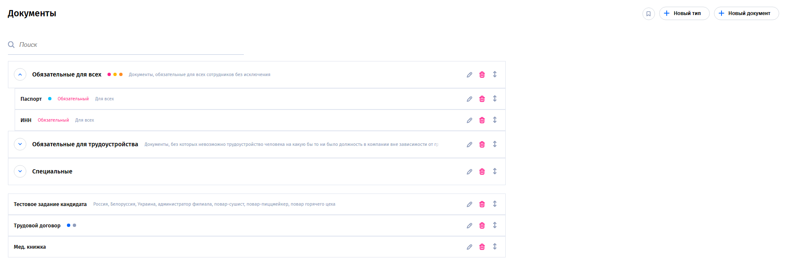

# Drag-and-drop demo

Тестовое задание: приложение для отображения и управления списком документов.

**[LIVE DEMO](https://lazenyuk-dmitry.github.io/doc-list-front-test/)**

- Списки документов можно перетаскивать за стрелку справой стороны.
- Категории можно сворачивать и разворачивать.
- Документы можно перемещать в категории, сортировать внутри категории и перетаскивать в категорию без сортировки.
- Категории можно сортировать между собой.
- Доступен поиск.

---



## 🛠️ Стек технологий

- Frontend: Vue / React (укажи что у тебя)
- State management: (Pinia / Redux / Zustand — что используешь)
- HTTP: Axios / Fetch
- Сборка: Vite / Webpack
- UI: (если есть — Tailwind / CSS / UI-kit)

## Рекомендованные настройки IDE

[VSCode](https://code.visualstudio.com/) + [Volar](https://marketplace.visualstudio.com/items?itemName=Vue.volar) (and disable Vetur) + [TypeScript Vue Plugin (Volar)](https://marketplace.visualstudio.com/items?itemName=Vue.vscode-typescript-vue-plugin).

## 📦 Установка и запуск

```bash
# Клонировать репозиторий
git clone https://github.com/lazenyuk-dmitry/doc-list-front-test.git

# Перейти в папку
cd doc-list-front-test

# Установить зависимости
npm install

# Запустить dev сервер
npm run dev
```
